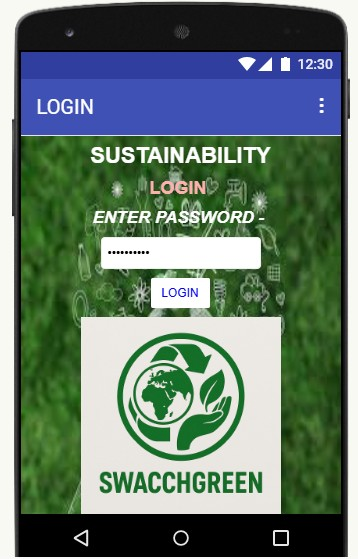
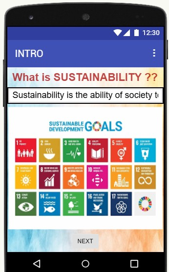
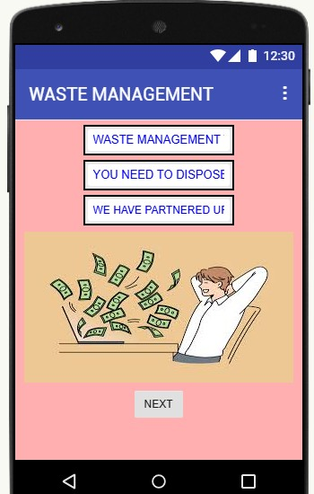
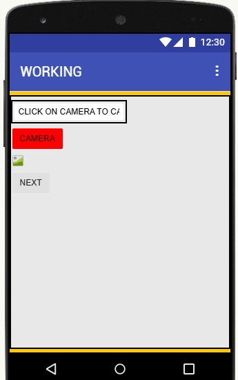
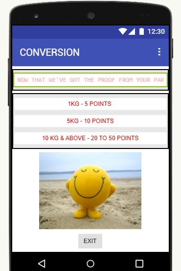

## SwacchGreen – Sustainable Waste Management App
SwacchGreen is a mobile application developed using MIT App Inventor under the domain of Sustainability and Circular Economy. The app focuses on promoting responsible waste management by enabling users to track waste disposal activities, monitor eco-friendly habits, and earn rewards for sustainable actions.
By turning everyday waste management into a rewarding and trackable experience, SwacchGreen encourages long-term eco-conscious behavior at both individual and community levels, aligning with modern principles of sustainable product design and environmental responsibility.
# Domain
Sustainability: Circular Economy Solutions, Waste Reduction Strategies, Sustainable Product Design
# Technology Used
MIT App Inventor
Android Platform
# Objective
To create a simple, user-friendly application that motivates users to adopt sustainable waste management practices through tracking, rewards, and awareness-driven design.
# Features
Allows users to record and track daily waste management activities.
Encourages waste segregation and responsible disposal practices.
Displays user progress to promote eco-friendly habits.
Reward-based motivation system to increase user engagement.
Simple and intuitive user interface suitable for all age groups.
Supports sustainability awareness aligned with circular economy principles.
# Screenshots
The following screenshots showcase the user interface and core functionalities of the SwacchGreen application developed using MIT App Inventor:
### LOGIN Screen

### INTRODUCTION Screen

### DESCRIPTION Screen

### WORKING Screen

### CONVERSION Screen

# Demo Video
A working video of the application can be found here:
[Watch Demo Video](https://drive.google.com/file/d/1roRtgjWz2IN_Wjgj8Rpk6AMDvpkDSAL2/view?usp=drivesdk)  
# Presentation / Documentation
The project PPT explaining the concept, features, and design can be found here:  
[SwacchGreen Presentation](docs/SwacchGreen_Presentation.pptx)
# How to Use
1. Import the `.aia` file into MIT App Inventor.
2. Connect an Android device or emulator.
3. Build and run the application.
4. Explore features, track waste, and earn rewards.
